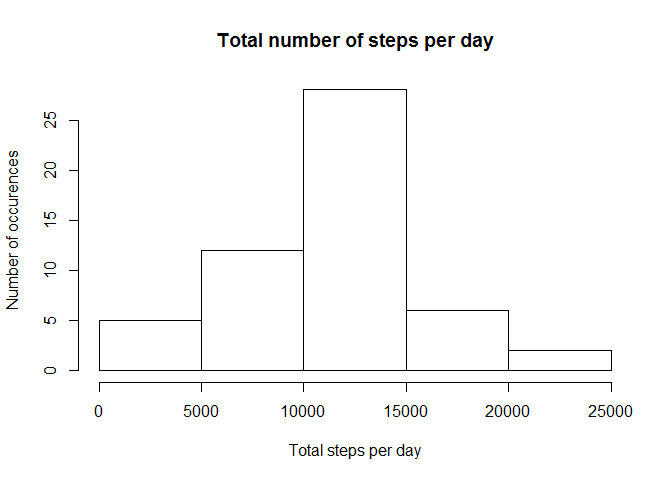
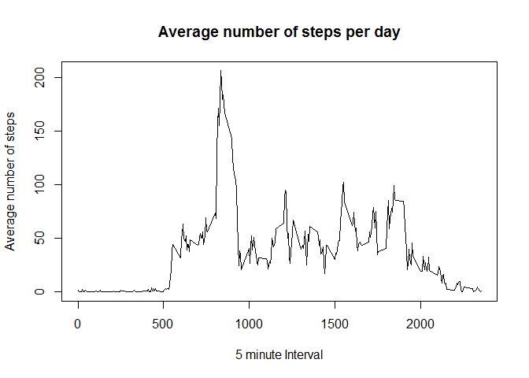
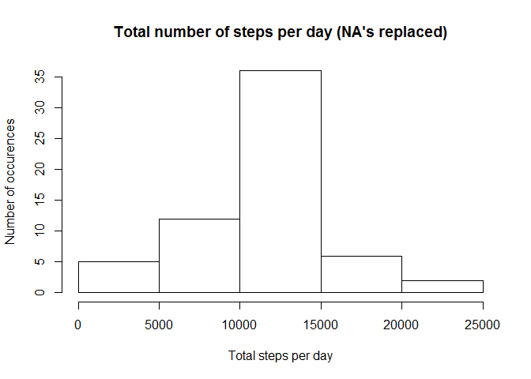
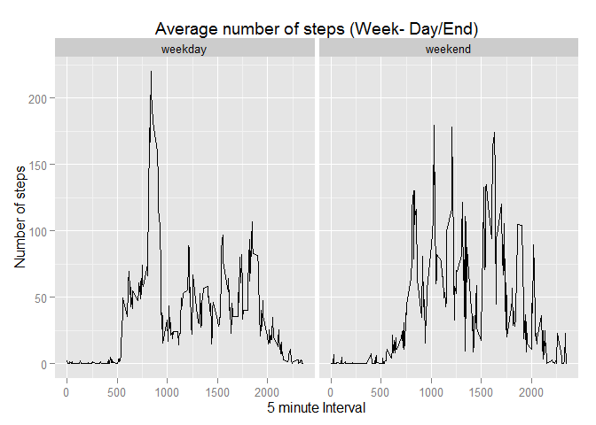

# Reproducible Research: Peer Assessment 1

Set working directory to a local Github location for RepData_PeerAssessment1.
Load required libraries for code execution.

```r
setwd("C:/Users/NNarasim/Git/RepData_PeerAssessment1")
library(data.table)
library(ggplot2)
```

## Loading and preprocessing the data
This reads the contents of the CSV file and removes all NA records.

```r
unzip ("activity.zip")
activity_all <- read.csv("activity.csv")
activity <- activity_all[complete.cases(activity_all),]
```


## What is mean total number of steps taken per day?
Aggregate the steps for each day to display in a histogram.

```r
activity_steps <- aggregate(steps ~ date, data = activity, FUN = sum)
hist(activity_steps$steps, 
        xlab = "Total steps per day", 
        ylab = "Number of occurences",
        main = "Total number of steps per day")
```

 

```r
act_mean <- mean(activity_steps$steps)
act_mean
```

```
## [1] 10766.19
```

```r
act_med <- median(activity_steps$steps)
act_med
```

```
## [1] 10765
```

The mean number of steps per day is **1.0766189\times 10^{4}**.
The median number of steps per day is **10765**.

## What is the average daily activity pattern?

```r
activity_interval <- aggregate(steps ~ interval, data = activity, FUN = mean)
plot(activity_interval$interval, 
        activity_interval$steps, 
        type = 'l',
        xlab = "5 minute Interval",
        ylab = "Average number of steps",
        main = "Average number of steps per day")
```

 

```r
activity_interval[which.max(activity_interval$steps),]
```

```
##     interval    steps
## 104      835 206.1698
```

```r
activity_interval.interval <- activity_interval[which.max(activity_interval$steps),1]
activity_interval.steps <- activity_interval[which.max(activity_interval$steps),2]
```

Interval **835** has the maximum number of steps of 
         **206**.

## Imputing missing values

```r
activity_NAs <- activity_all[!complete.cases(activity_all),]
nrow(activity_NAs)
```

```
## [1] 2304
```

Of the **17568**, a total of **2304**
have NA values which are excluded from the numeric calcuations.


Replace missing NA values in the data with the average of the 5-minute interval.

```r
activity_noNAs <- activity_all
for (i in 1 : nrow(activity_noNAs))
    {
        if (is.na(activity_noNAs$steps[i]))
            {
                interval_value <- activity_noNAs$interval[i]
                row_num <- which(activity_interval$interval == interval_value)
                steps_value <- activity_interval$steps[row_num]
                activity_noNAs$steps[i] <- steps_value
            }
    }
```

Aggregate the steps for each day to display in a histogram where NA values have been
replaced with the average of 5-minute intervals.

```r
activity_clean <- aggregate(steps ~ date, data = activity_noNAs, FUN = sum)
hist(activity_clean$steps, 
        xlab = "Total steps per day", 
        ylab = "Number of occurences",
        main = "Total number of steps per day (NA's replaced)")
```

 

```r
act_clean_mean <- mean(activity_clean$steps)
act_clean_mean
```

```
## [1] 10766.19
```

```r
act_clean_med <- median(activity_clean$steps)
act_clean_med
```

```
## [1] 10766.19
```

The mean number of steps per day is **1.0766189\times 10^{4}**.

The median number of steps per day is **1.0766189\times 10^{4}**.

After replacing the NA values, we notice that the mean is the same with or without
NA replacement.  However the median has increased by 1 with NA replacement.
This is not a significant difference.

## Are there differences in activity patterns between weekdays and weekends?
Group dates into weekdays or weekends.

```r
activity_noNAs$date <- as.Date(activity_noNAs$date, "%Y-%m-%d")
activity_noNAs$dayname <- weekdays(activity_noNAs$date)

activity_noNAs$daytype <- "weekday"
for (i in 1:nrow(activity_noNAs))
    {
        if (activity_noNAs$dayname[i] == "Sunday" || activity_noNAs$dayname[i] == "Sunday")
            {
                activity_noNAs$daytype[i] <- "weekend"
            }
}
```

Graph of weekend versus weekdays.

```r
activity_noNAs$daytype <- as.factor(activity_noNAs$daytype)
activity_clean_steps <- aggregate(steps ~ interval + daytype, data = activity_noNAs, FUN = mean)

qplot(interval, 
            steps, 
            data = activity_clean_steps, 
            type = 'l', 
            geom = c("line"), 
            xlab = "5 minute Interval", 
            ylab = "Number of steps", 
            main = "Average number of steps (Week- Day/End)"
      ) + facet_wrap(~ daytype)
```

 

There appears to be a higher average of steps over weekends when compared to weekdays.
